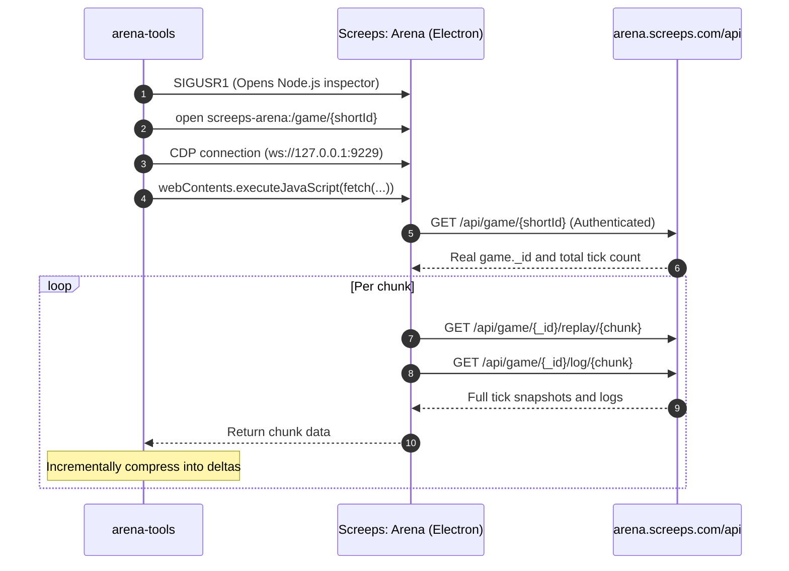

# Screeps: Arena Tools

A zero-dependency, buildless toolchain to **fetch, normalize, and view** [Screeps: Arena](https://arena.screeps.com/) match replays. Runs directly on Node.js.

- **fetch** — Fetch match replays and console logs accessible by your account via the running Screeps: Arena client
- **normalize** — Compress raw per-tick complete snapshots (280MB+ per match) into deltas of **tens of kilobytes**
- **view** — Replay matches in your browser: terrain, structures, creeps, attacks/heals, energy, and flag captures
- **plugins** — Overlay bot-specific internal state **without forking the codebase**

```bash
npx arena-tools fetch https://arena.screeps.com/game/XTTCQ7DA4T
npx arena-tools view
```

---

## Requirements

- **Node.js 20+**
- **macOS** (for `fetch` only; `view` and `convert` work on any OS)
- **Screeps: Arena (Steam version) running and logged in**

`fetch` can only retrieve matches that your account has permission to view.
It does not forge credentials; instead, **it delegates fetching to your already-authenticated local game client** (explained below).

---

## Usage

### Fetch a Match

You can paste either a full URL or a short ID directly:

```bash
arena-tools fetch https://arena.screeps.com/game/XTTCQ7DA4T
arena-tools fetch XTTCQ7DA4T
arena-tools fetch XTTCQ7DA4T -o replays/vs-opponent.json.gz
```

```
=== Screeps: Arena Tools ===
Match: https://arena.screeps.com/game/XTTCQ7DA4T
  found-app: PID 84210
  connected: ws://127.0.0.1:9229/...
  resolved: 6a91f24fe5664ad5be8d41a3 / 2000 ticks
  fetching 21/21 (tick 2000)

Saved: replays/XTTCQ7DA4T.replay.json.gz (28.9 KB)
  playerA vs playerB — 2000 ticks, draw
```

### View Replays

```bash
arena-tools view                 # http://localhost:5544/
arena-tools view --port 8080 --replays ./replays
```

| Action | Control |
| --- | --- |
| Play / Pause | `Space` |
| Step 1 Tick | `←` `→` |
| Step 10 Ticks | `Shift` + `←` `→` |
| Pan / Zoom board | Drag / Scroll wheel |
| Reset board position & zoom | Double click / `0` / `R` |
| Open file | Drag & drop file onto the board |

### Convert Existing Raw Data

```bash
arena-tools convert match_XTTCQ7DA4T.json --short-id XTTCQ7DA4T
arena-tools info replays/XTTCQ7DA4T.replay.json.gz
```

---

## Why Normalize?

The endpoint `/api/game/{id}/replay/{chunk}` returns **full state snapshots per tick, not deltas**.
A 100x100 Arena contains over 330 structures alone, all repeated for 2,000 ticks.

Actual measurements (`XTTCQ7DA4T`, 2000 ticks):

| | Size |
| --- | --- |
| Raw API JSON | **285.2 MB** |
| Normalized (deltas) | **0.50 MB** |
| Gzip compressed | **0.03 MB** |

Most of the board remains static during a game. By storing static properties only once upon introduction and recording only modifications per tick, file sizes shrink by over two orders of magnitude.

The conversion is **lossless**. All 2001 ticks and 696,435 entities have been verified against raw snapshots with zero differences (tested in `test/normalize.test.ts`).

For format details, see [`docs/FORMAT.md`](docs/FORMAT.md).

---

## How It Works

The Screeps Arena game API validates Steam authentication sessions and rejects direct external requests with `401 Unauthorized`.
However, your running desktop client already holds a valid authenticated session:



Key points:

- **Short IDs use a two-step resolution.** `/api/game/{shortId}` resolves the short ID to a MongoDB ObjectId. The replay API requires this ObjectId; passing the short ID directly results in `502 Bad Gateway`.
- **Chunks are compressed as they arrive.** Collecting all chunks before processing would require buffering ~280MB of raw data in memory.
- **You can only fetch matches accessible to your account.** This does not bypass permissions.

---

## Overlaying Bot Internal State (Plugins)

The viewer renders **only universal game information accessible in any match**.
It deliberately excludes bot-specific concepts like custom squad roles or tactical evaluation scores.

Instead, internal state is transferred **via the console log as a metadata transport**. Your bot only needs to use `console.log`; no modifications are needed to the replay format, fetcher, or viewer core. **No forks required.**

```js
// Bot side
console.log(`@zones ${JSON.stringify({ 0: [3, 2, 1] })}`);
console.log(`@creepZone ${JSON.stringify({ "335": 0, "340": 2 })}`);
```

```bash
arena-tools view --plugins ~/my-bot/arena-plugins
```

For logs without `@zones` (e.g. opponents' or other players' games), the plugin automatically sleeps.
See [`docs/PLUGINS.md`](docs/PLUGINS.md) for the guide and [`examples/plugins/macro-zones.ts`](examples/plugins/macro-zones.ts) for a working example.

---

## Library Usage

```ts
import { normalizeMatch, buildTimeline, stateAt } from "screeps-arena-tools";

const doc = normalizeMatch(JSON.parse(raw));
const timeline = buildTimeline(doc);
const state = stateAt(timeline, 600);   // Board state at tick 600

for (const creep of state.creeps.values()) {
    console.log(creep.id, creep.x, creep.y, creep.hits, creep.body);
}
```

---

## Development

```bash
npm run build     # Compile TypeScript (tsc) to dist/
npm run typecheck # Run TypeScript compiler in typecheck-only mode
npm test          # Build and run node --test (uses real match fixtures)
```

---

## Notes

- Fetched replays contain players' usernames. Review before publishing publicly.
- `SIGUSR1` enables the Node.js debugger on the game process. Restarting the game client after fetching is recommended.
- The tool relies on internal Electron/API behaviors which may change in future Screeps Arena updates.

## License

MIT
