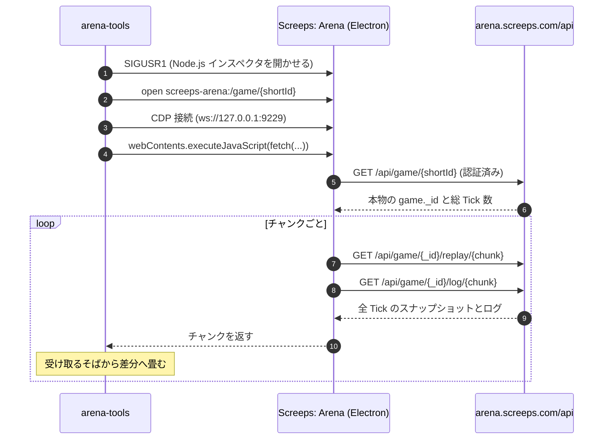

# Screeps: Arena Tools

[Screeps: Arena](https://arena.screeps.com/) の対戦リプレイを **取得 → 正規化 → 閲覧** するための道具一式。
依存パッケージ無し、ビルド工程無し。Node.js だけで動く。

- **fetch** — 起動中の Screeps: Arena 経由で、自分が見られる試合のリプレイとコンソールログを取得する
- **正規化** — API が返す毎 Tick の完全スナップショット（1 試合 280MB 超）を差分に畳んで **数十 KB** にする
- **view** — ブラウザで盤面を再生する。地形・構造物・creep・攻撃/回復・エネルギー・flag の奪取まで
- **plugins** — ボット固有の内部状態を、**本体を fork せずに**足せる

```
npx arena-tools fetch https://arena.screeps.com/game/XTTCQ7DA4T
npx arena-tools view
```

---

## 必要なもの

- **Node.js 20 以上**
- **macOS**（`fetch` のみ。`view` と `convert` はどの OS でも動く）
- **Steam 版 Screeps: Arena が起動していて、ログイン済みであること**

`fetch` は「自分のアカウントで閲覧できる試合」しか取得できない。
認証を偽造するものではなく、**すでにログインしている自分のクライアントに取りに行かせている**（後述）。

---

## 使い方

### 取得する

URL をそのまま貼ってよい。短縮 ID でもよい。

```bash
arena-tools fetch https://arena.screeps.com/game/XTTCQ7DA4T
arena-tools fetch XTTCQ7DA4T
arena-tools fetch XTTCQ7DA4T -o replays/vs-kerobee.json.gz
```

```
=== Screeps: Arena Tools ===
試合: https://arena.screeps.com/game/XTTCQ7DA4T
  found-app: PID 84210
  connected: ws://127.0.0.1:9229/...
  resolved: 6a91f24fe5664ad5be8d41a3 / 2000 ticks
  取得中 21/21 (tick 2000)

保存: replays/XTTCQ7DA4T.replay.json.gz (28.9 KB)
  arukuka vs Opponent — 2000 ticks, draw
```

### 見る

```bash
arena-tools view                 # http://localhost:5544/
arena-tools view --port 8080 --replays ./replays
```

| 操作 | |
| --- | --- |
| `Space` | 再生 / 一時停止 |
| `←` `→` | 1 Tick |
| `Shift` + `←` `→` | 10 Tick |
| ドラッグ / ホイール | 盤面の移動 / ズーム |
| ダブルクリック・`0`・`R` | 初期位置に戻す |
| ファイルをドロップ | その場で開く |

### すでに手元にある生データを変換する

```bash
arena-tools convert match_XTTCQ7DA4T.json --short-id XTTCQ7DA4T
arena-tools info replays/XTTCQ7DA4T.replay.json.gz
```

---

## なぜ変換するのか

`/api/game/{id}/replay/{chunk}` が返すのは **差分ではなく毎 Tick の完全スナップショット**。
100x100 の Arena は構造物だけで 336 個あり、その全部が 2000 Tick ぶん繰り返される。

実測（`XTTCQ7DA4T`, 2000 Tick）:

| | サイズ |
| --- | --- |
| API が返す生 JSON | **285.2 MB** |
| 正規化（差分化）後 | **0.50 MB** |
| gzip 後 | **0.03 MB** |

盤面のほとんどは試合中ずっと動かない。動かない属性を初出時に 1 回だけ持ち、
変わったものだけを Tick ごとに記録すれば、それだけで 2 桁縮む。

変換は**可逆**である。全 2001 Tick・696,435 エンティティを生スナップショットと
突き合わせて差異が無いことを確認しており、その検証は `test/normalize.test.js` に入っている。

形式の詳細は [`docs/FORMAT.md`](docs/FORMAT.md)。

---

## 仕組み

Arena のゲーム API は Steam 認証セッションを見ており、外部から直接叩くと `401` で弾かれる。
一方、いま自分の PC で動いているクライアントはその認証を持っている。



要点:

- **短縮 ID は 2 段構造。** `/api/game/{shortId}` は本物の MongoDB ObjectId を返すだけの解決用。
  リプレイ本体は ObjectId を要求し、短縮 ID を渡すと `502` になる。
- **チャンクは受け取るそばから畳む。** 全部集めてから変換すると 280MB を一度に抱えることになる。
- **取得できるのは自分が見られる試合だけ。** 権限の壁を越えるものではない。

---

## ボットの内部状態を重ねる（プラグイン）

本体が描くのは **誰の試合でも読み取れる情報だけ**。
役割分担や作戦モードのような、自分のボットにしか無い概念は扱わない。

それらは **コンソールログをメタ情報の運搬路にして**足す。ボット側は `console.log` するだけでよく、
リプレイ形式にもフェッチャにも、ビューア本体にも手を入れない。**fork も要らない。**

```js
// ボット側
console.log(`@zones ${JSON.stringify({ 0: [3, 2, 1] })}`);
console.log(`@creepZone ${JSON.stringify({ "335": 0, "340": 2 })}`);
```

```bash
arena-tools view --plugins ~/my-bot/arena-plugins
```

`@zones` を含まないログ（他人の試合）では、そのプラグインは自動的に寝る。
書き方は [`docs/PLUGINS.md`](docs/PLUGINS.md)、動く例は [`examples/plugins/macro-zones.js`](examples/plugins/macro-zones.js)。

---

## ライブラリとして使う

```js
import { normalizeMatch, buildTimeline, stateAt } from "screeps-arena-tools";

const doc = normalizeMatch(JSON.parse(raw));
const timeline = buildTimeline(doc);
const state = stateAt(timeline, 600);   // Tick 600 の盤面

for (const creep of state.creeps.values()) {
    console.log(creep.id, creep.x, creep.y, creep.hits, creep.body);
}
```

---

## 開発

```bash
npm test          # node --test（実試合をフィクスチャに使う）
npm run typecheck # JSDoc 型注釈を tsc で確認
```

`src/` の JS はブラウザからもそのまま読まれる。
変換ロジックを Node 側とビューア側で二重に持たないため、ビルド工程を置いていない。

---

## 注意

- 取得したリプレイには対戦相手のユーザ名が入る。公開する前に確認すること。
- `SIGUSR1` はデバッガを開かせる。作業が終わったらアプリを再起動しておくと行儀がよい。
- API の仕様が変われば壊れる。仕様は公開されていない。

## ライセンス

MIT
