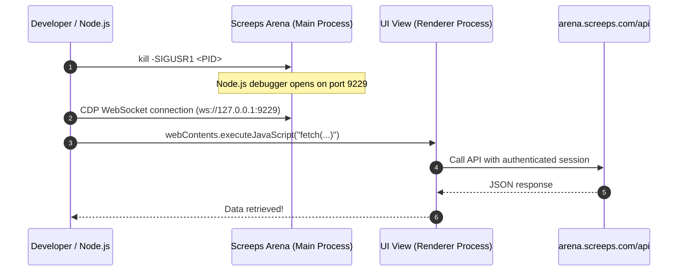

# Screeps: Arena Internal API Reverse Engineering Guide

This document explains the practical methodology used to discover and explore the internal APIs and match history endpoints of Screeps: Arena by leveraging `SIGUSR1` and the Chrome DevTools Protocol (CDP) on the running desktop client (Steam / Electron app).

Every step and code snippet is detailed in order so that it can be reproduced locally.

---

## Overall Architecture

Screeps: Arena is built with **Electron** and communicates with the backend API (`arena.screeps.com/api`).
When making direct requests via `curl` or external scripts, requests are rejected with `401 Unauthorized` because they lack a valid Steam authentication session.

However, **executing `fetch()` directly from within the running desktop app (the Renderer process) automatically includes the authenticated cookies and headers managed by the application**, allowing the request to be processed normally.



---

## Step 1: Identifying the Process and Application Path

First, locate the running Screeps: Arena process:

```bash
ps ax -o pid=,command= | grep -i '[s]creeps_arena.app/Contents/MacOS/screeps_arena' | grep -v Helper
```

Example output:
```text
92019 /Users/.../Steam/steamapps/common/ScreepsArena/screeps_arena.app/Contents/MacOS/screeps_arena
```

Key information obtained here:
- **PID**: `92019`
- **Application resources path**: `.../screeps_arena.app/Contents/Resources/app`

---

## Step 2: Opening the Debugger with SIGUSR1

Node.js has a built-in feature where sending a `SIGUSR1` signal to a running process activates its internal inspector agent:

```bash
kill -SIGUSR1 92019
```

Verify that the inspector opened:

```bash
curl -s http://127.0.0.1:9229/json
```

Example output:
```json
[
  {
    "description": "node.js instance",
    "id": "...",
    "title": "screeps_arena",
    "type": "node",
    "webSocketDebuggerUrl": "ws://127.0.0.1:9229/..."
  }
]
```

Using this `webSocketDebuggerUrl`, we can directly control the main process via the Chrome DevTools Protocol (CDP).

---

## Step 3: Accessing the Renderer (Browser UI) via CDP

In Electron, code can be evaluated in the UI's JavaScript context from the main process by calling `BrowserWindow.getAllWindows()[0].webContents.executeJavaScript(...)`.

Here is the minimal Node.js code to achieve this (as implemented in `src/cdp.ts`):

```javascript
const Module = process.mainModule ? process.mainModule.constructor : (new Function('return this'))().module.constructor;
const req = Module.createRequire(process.cwd() + '/');
const { BrowserWindow } = req('electron');
const win = BrowserWindow.getAllWindows()[0];
return await win.webContents.executeJavaScript(`/* JS code to execute */`);
```

---

## Step 4: Inspecting Current URL and LocalStorage

To investigate what is happening inside the UI, evaluate the following expression:

```javascript
({
    href: window.location.href,
    title: document.title,
    localStorageKeys: Object.keys(localStorage),
})
```

Running this yielded critical insights:

1. **Current URL**:
   `file:///.../dist/#/arenas/6a86d8c454a3948a1e35f90c/games/6a9a5b41688548fac5bd8618`
   - Identified `6a86d8c454a3948a1e35f90c` as the Arena ID for *Pain and Gain*!
   - Identified `6a9a5b41688548fac5bd8618` as the Game ID of the most recent match!

2. **LocalStorage**:
   - `arena_local_settings_6a86d8c454a3948a1e35f90c_running_game`:
     `{"sourceFolder":"/Users/arukuka/ScreepsArena/season4-pain_and_gain", ...}`
   - `6a9a5b41688548fac5bd8618_viewed: "true"`
     Discovered that previously viewed match IDs are persisted in bulk as `[gameId]_viewed`.

---

## Step 5: Reading the Application's JavaScript Source Code

The most reliable way to find out which APIs the UI communicates with is to **inspect the application's client bundle itself**.

Checking `document.querySelectorAll('script')` revealed that the following scripts were loaded:
- `dist/polyfills.js`
- `dist/main.js`

Because the Electron Renderer runs under the `file://` protocol, `fetch()` can be used from within the Renderer to read local `main.js` (a multi-megabyte bundle) into a string in an instant:

```javascript
const res = await fetch("file:///Users/.../dist/main.js");
const code = await res.text();
```

---

## Step 6: Uncovering APIs via Code Grep

We can search the loaded `code` string using regular expressions.

### 1. Extracting `apiUrl` Usages
```javascript
const regex = /apiUrl[^\n;]{1,100}/g;
const matches = code.match(regex);
```

This immediately revealed Angular `HttpClient` calls:
```text
${environment.apiUrl}/user/${userId}/saved-games
${environment.apiUrl}/arena/${arenaId}/rating-history
${environment.apiUrl}/arena/${arenaId}/last-games
${environment.apiUrl}/season/current
${environment.apiUrl}/season/${seasonId}/arenas
```

### 2. Inspecting Method Context
To inspect Angular service definitions, we extracted the surrounding code for terms like `"rating-history"` and `"last-games"`:

```javascript
function getContext(term, length = 800) {
    const idx = code.indexOf(term);
    return code.slice(idx - 100, idx + length);
}
```

This confirmed the following API specifications:
- Ranked match history is fetched via `/api/arena/{arenaId}/rating-history`.
- It accepts query parameters `limit` (number of items) and `offset` (pagination).
- Current user profile can be retrieved via `/api/auth/me`.
- The list of arenas `/api/season/{id}/arenas` can be retrieved starting from the current season at `/api/season/current`.

---

## Step 7: Verifying via Live API Calls

Executing fetch directly within the Renderer context:

```javascript
const res = await fetch(
    "https://arena.screeps.com/api/arena/6a86d8c454a3948a1e35f90c/rating-history?limit=50&offset=0",
    { credentials: "include" }
);
const data = await res.json();
console.log(data);
```

Received response:
```json
{
  "ok": 1,
  "history": [
    {
      "game": {
        "_id": "6a9a5b41688548fac5bd8618",
        "status": "finished",
        "result": { "winner": 0 },
        "meta": { "ticks": 314 }
      },
      "users": [
        { "username": "Opponent" },
        { "username": "arukuka" }
      ],
      "ratingHistory": {
        "previousRating": 655,
        "rating": 654
      }
    },
    ...
  ],
  "meta": { "length": 15 }
}
```

This confirmed that full metadata for 15 played matches (outcomes, opponents, ticks, game IDs) could be retrieved seamlessly.

---

## Summary & One-Liner to Try It Yourself

As long as Screeps: Arena is running, anyone can inspect internal state locally with Node.js using this one-liner:

```bash
node -e '
import("./dist/src/sync.js").then(async ({ openArenaSession }) => {
    const session = await openArenaSession();
    const result = await session.evaluateInRenderer(`
        fetch("https://arena.screeps.com/api/auth/me", { credentials: "include" })
            .then(r => r.json())
    `);
    console.log("Logged in user:", result);
    session.close();
});
'
```

Since Electron applications are essentially "Chromium + Node.js", enabling the inspector grants full freedom to inspect and interact with the application, exactly like using the DevTools console in a web browser.
