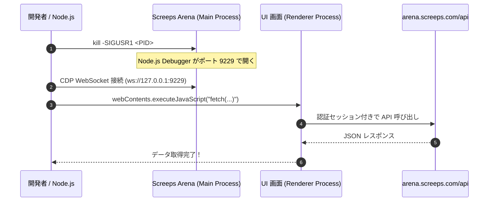

# Screeps: Arena 内部 API リバースエンジニアリング手法ガイド

本ドキュメントでは、起動中の Screeps: Arena（Steam / Electron アプリ）から `SIGUSR1` と Chrome DevTools Protocol (CDP) を駆使して内部 API や対戦履歴エンドポイントを特定・探索した実際の手法を解説します。

自身の手元でも 100% 再現できるように、順を追って手順とコードを記載しています。

---

## 全体アーキテクチャ

Screeps: Arena は **Electron** で構築されており、バックエンド API (`arena.screeps.com/api`) と通信しています。
外部の `curl` やスクリプトから直接 API を叩くと、Steam の認証セッションが存在しないため `401 Unauthorized` で弾かれます。

しかし、**起動中のデスクトップアプリ内部（Renderer プロセス）から `fetch()` を実行すれば、アプリが保持する認証 Cookie やヘッダーが自動的に付与される**ため、正規のリクエストとして処理されます。



---

## ステップ 1: プロセス特定とアプリ本体パスの確認

まずは稼働中の Screeps: Arena プロセスを探します。

```bash
ps ax -o pid=,command= | grep -i '[s]creeps_arena.app/Contents/MacOS/screeps_arena' | grep -v Helper
```

出力例:
```text
92019 /Users/.../Steam/steamapps/common/ScreepsArena/screeps_arena.app/Contents/MacOS/screeps_arena
```

ここで得られる情報：
- **PID**: `92019`
- **アプリリソースの場所**: `.../screeps_arena.app/Contents/Resources/app`

---

## ステップ 2: SIGUSR1 でデバッガを開く

Node.js は、実行中プロセスに `SIGUSR1` シグナルを受信すると内部インスペクターを有効化する組み込み機能を持っています。

```bash
kill -SIGUSR1 92019
```

開いたかどうかを確認します：

```bash
curl -s http://127.0.0.1:9229/json
```

出力例:
```json
[
  {
    "description": "node.js instance",
    "id": "...",
    "title": "screeps_arena",
    "type": "node",
    "webSocketDebuggerUrl": "ws://127.0.0.1:9229/..."
  }
]
```

この `webSocketDebuggerUrl` を使って、Chrome DevTools Protocol (CDP) でメインプロセスを直接操作できるようになります。

---

## ステップ 3: CDP で Renderer（ブラウザ画面）に入り込む

Electron では、メインプロセスから `BrowserWindow.getAllWindows()[0].webContents.executeJavaScript(...)` を呼ぶことで、画面側の JavaScript コンテキストにコードを注入できます。

これを Node.js スクリプトから行う最小限のコード（`src/cdp.ts` 内の実装）:

```javascript
const Module = process.mainModule ? process.mainModule.constructor : (new Function('return this'))().module.constructor;
const req = Module.createRequire(process.cwd() + '/');
const { BrowserWindow } = req('electron');
const win = BrowserWindow.getAllWindows()[0];
return await win.webContents.executeJavaScript(`/* 実行したいJS */`);
```

---

## ステップ 4: 現在地 (URL) と LocalStorage の偵察

画面側で何が起きているかを探るため、以下の式を評価しました：

```javascript
({
    href: window.location.href,
    title: document.title,
    localStorageKeys: Object.keys(localStorage),
})
```

実行すると、以下のような決定的な情報が手に入りました：

1. **現在の URL**:
   `file:///.../dist/#/arenas/6a86d8c454a3948a1e35f90c/games/6a9a5b41688548fac5bd8618`
   - `6a86d8c454a3948a1e35f90c` が Pain and Gain のアリーナ ID だと判明！
   - `6a9a5b41688548fac5bd8618` は直前の対戦 Game ID だと判明！

2. **LocalStorage**:
   - `arena_local_settings_6a86d8c454a3948a1e35f90c_running_game`:
     `{"sourceFolder":"/Users/arukuka/ScreepsArena/season4-pain_and_gain", ...}`
   - `6a9a5b41688548fac5bd8618_viewed: "true"`
     過去に表示したゲーム ID が大量に `[gameId]_viewed` として保存されていることを発見。

---

## ステップ 5: アプリ本体の JS ソースコードを読む

「画面側がどの API を叩いているか」を知る一番確実な方法は、**アプリ自身のバンドルコードを調べること**です。

`document.querySelectorAll('script')` を見ると、以下のスクリプトが読み込まれていました：
- `dist/polyfills.js`
- `dist/main.js`

Electron の Renderer は `file://` プロトコルで動いているため、Renderer 内から `fetch()` でローカルの `main.js`（数MBのバンドル全体）を文字列として一瞬で読み取れます：

```javascript
const res = await fetch("file:///Users/.../dist/main.js");
const code = await res.text();
```

---

## ステップ 6: ソースコード grep による API 発掘

読み込んだ `code` に対して正規表現で検索をかけます。

### 1. `apiUrl` の使われ方を抽出
```javascript
const regex = /apiUrl[^\n;]{1,100}/g;
const matches = code.match(regex);
```

すると、Angular の HttpClient 呼び出しが続々と出現しました：
```text
${environment.apiUrl}/user/${userId}/saved-games
${environment.apiUrl}/arena/${arenaId}/rating-history
${environment.apiUrl}/arena/${arenaId}/last-games
${environment.apiUrl}/season/current
${environment.apiUrl}/season/${seasonId}/arenas
```

### 2. メソッド定義の文脈を調査
Angular のサービス定義を調べるため、`"rating-history"` や `"last-games"` の周辺コードを切り出します：

```javascript
function getContext(term, length = 800) {
    const idx = code.indexOf(term);
    return code.slice(idx - 100, idx + length);
}
```

これにより、以下の事実が完全に判明しました：
- レーティング対戦の履歴は `/api/arena/{arenaId}/rating-history` を叩いている。
- クエリパラメータとして `limit`（取得件数）と `offset`（ページネーション）を受け取る。
- ユーザー情報は `/api/auth/me` で取得できる。
- シーズン情報 `/api/season/current` からアリーナ一覧 `/api/season/{id}/arenas` が取得できる。

---

## ステップ 7: 実際に API を叩いて検証する

 Renderer コンテキスト内で直接 fetch を実行：

```javascript
const res = await fetch(
    "https://arena.screeps.com/api/arena/6a86d8c454a3948a1e35f90c/rating-history?limit=50&offset=0",
    { credentials: "include" }
);
const data = await res.json();
console.log(data);
```

返ってきたレスポンス：
```json
{
  "ok": 1,
  "history": [
    {
      "game": {
        "_id": "6a9a5b41688548fac5bd8618",
        "status": "finished",
        "result": { "winner": 0 },
        "meta": { "ticks": 314 }
      },
      "users": [
        { "username": "Opponent" },
        { "username": "arukuka" }
      ],
      "ratingHistory": {
        "previousRating": 655,
        "rating": 654
      }
    },
    ...
  ],
  "meta": { "length": 15 }
}
```

ここで、ユーザーがプレイした 15 試合の全メタデータ（勝敗、相手、Ticks、ゲームID）が完璧に取得できたことが確認できました。

---

## まとめ・自分で試すためのワンライナー

起動中の Screeps: Arena があれば、以下のスクリプトを Node.js で動かすだけで誰でも手元で内部状態を覗き見ることができます：

```bash
node -e '
import("./dist/src/sync.js").then(async ({ openArenaSession }) => {
    const session = await openArenaSession();
    const result = await session.evaluateInRenderer(`
        fetch("https://arena.screeps.com/api/auth/me", { credentials: "include" })
            .then(r => r.json())
    `);
    console.log("Logged in user:", result);
    session.close();
});
'
```

Electron アプリは本質的に「Chromium + Node.js」であるため、インスペクターを開くことさえできれば、Web ブラウザの DevTools コンソールでデバッグするのと全く同じ自由度で内部を調査することができます。
